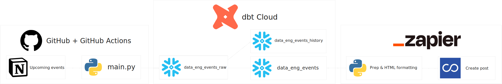

<h1>Data Engineering events notifier</h1>

This project was created to send out an internal notification for the coming week's upcoming Data Engineering events.

Produced by Nathan Purvis - [Databasyx](https://www.databasyx.com/) co-founder | Data Engineer @ [The Information Lab](https://www.theinformationlab.co.uk/)

<h2>Contact</h2>

[GitHub](https://github.com/DataNath) | [LinkedIn](https://www.linkedin.com/in/nathan-purvis/) | [Twitter](https://x.com/DataNath) | [Alteryx Community](https://community.alteryx.com/t5/user/viewprofilepage/user-id/307299)  
Email: Nathan@databasyx.com

<h2>Overview</h2>

Technologies used:

1. Notion
    - Upcoming events Database
2. Python
    - Packages: dotenv, jsonpath_ng, os, pandas, requests, snowflake.connector
3. GitHub Actions
    - Weekly schedule to refresh raw (bronze layer) events table
4. dbt Cloud
    - Scheduled job run every Sunday, creates a curated table of events within the next week, as well as updating a historical Snapshot table
5. Zapier
    - Pulls data from the curated data_eng_events table, applies HTML formatting and posts to Convo
6. Convo
    - Internal communication platform, post addressed to relevant groups



<h2>Key steps</h2>

<details>
<summary><strong style="font size 24px;";>main.py</strong></summary>

>
Using environment variables to pull in GitHub Actions secrets
```python
database_id     = os.getenv("DATABASE_ID")
bearer_token    = os.getenv("BEARER_TOKEN")
sf_user         = os.getenv("USER")
sf_password     = os.getenv("PASSWORD")
sf_account      = os.getenv("ACCOUNT")
sf_warehouse    = os.getenv("WAREHOUSE")
sf_database     = os.getenv("DATABASE")
sf_schema       = os.getenv("SCHEMA")
```


Picking out target attributes in the API response using JSONPath
```python
details = {
            "uid":   page.get("id"),
            "name": "$.properties.Name.title[*].text.content",
            "date": "$.properties.Date.date.start",
            "time": "$.properties.Time.rich_text[*].text.content",
            "url":  "$.properties.Link.url"
        }
```

Use a cursor object to execute various SQL statements
    - Drop the current table, return record count of newly-created table & cast new grants ready for dbt

```python
drop_query = f'DROP TABLE IF EXISTS "{table_name}"'
conn.cursor().execute(drop_query)

count_query = f'SELECT COUNT(*) FROM "{table_name}"'
count = conn.cursor().execute(count_query).fetchone()[0]

grant_query = f"GRANT SELECT ON ALL TABLES IN SCHEMA {sf_schema} TO ROLE CORE"
grant = conn.cursor().execute(grant_query)
```

</details>

<details>
<summary><strong style="font size 24px;";>actions.yml</strong></summary>

>
Set up cron scheduling for midday every Sunday
```yml
on:
  schedule:
    - cron: "0 12 * * 0"
```

Install latest version of pip and all required packages
```yml
- name: Environment setup
        run: |
          python -m pip install --upgrade pip
          pip install -r requirements.txt
```

Sets environment variables from GitHub Actions secrets then runs Python unbuffered
```yml
- name: Run script
        env:
          DATABASE_ID:  ${{secrets.DATABASE_ID}}
          BEARER_TOKEN: ${{secrets.BEARER_TOKEN}}
          USER:         ${{secrets.USER}}
          PASSWORD:     ${{secrets.PASSWORD}}
          ACCOUNT:      ${{secrets.ACCOUNT}}
          WAREHOUSE:    ${{secrets.WAREHOUSE}}
          DATABASE:     ${{secrets.DATABASE}}
          SCHEMA:       ${{secrets.SCHEMA}}
        run: |
          python -u main.py
```

</details>

<details>
<summary><strong style="font size 24px;";>dbt Cloud</strong></summary>

>
Configure Snapshot table to show changes to events
```yml
version: 2

snapshots:
  - name: data_eng_events_history
    relation: source('bronze', 'data_eng_events_raw')
    config:
      unique_key: '"uid"'
      strategy: check
      check_cols: all
      hard_deletes: new_record
      snapshot_meta_column_names:
        dbt_scd_id: scd_hash
        dbt_updated_at: updated_at
        dbt_valid_from: valid_from_date
        dbt_valid_to: valid_until_date
        dbt_is_deleted: has_been_deleted
      dbt_valid_to_current: DATEADD(day, 1, CURRENT_DATE)
```

Set up correct materializations and ensure correct grants on gold objects ready for Zapier
```yml
models:
  data_eng_events_notifier:
    silver:
      +materialized: ephemeral
    gold:
      +materialized: table
      +grants:
        select: "DATASCHOOL"
```

</details>

<details>
<summary><strong style="font size 24px;";>Zapier</strong></summary>

>
Pull only relevant fields from snowflake
```sql
SELECT
  *
EXCLUDE
  "uid"
FROM DATA_ENG_EVENTS
ORDER BY
  "date",
  "time"
```

Code by Zapier - Python to create formatted Convo post
```python
name = inputData['name'].split(',')
date = inputData['date'].split(',')
time = inputData['time'].split(',')
link = inputData['link'].split(',')

combined = list(zip(name, date, time, link))

combined.sort(key=lambda x: (x[1], x[2]))

message = 'Upcoming events this week:<br>'+chr(0x200B)+'<br>'

for n, d, t, l in combined:
    message += f"\U0001F4DA Name: {n}<br>"
    message += f"\U0001F4C6 Date: {d}<br>"
    message += f"\U0001F55D Time: {t}<br>"
    message += f'\U0001F517 URL: <a href="{l}">Event page</a><br>'+chr(0x200B)+'<br>'

message += 'Hope to see you there! Remember to write up a reflective post to share your thoughts and any interesting learnings/connections!'

return{"output": message}
```

</details>

<h2>Feedback and/or issues</h2>

Please feel free to leave any feeback or suggestions for improvement. If you spot any issues, let me know and I'll endeavour to address them as soon as I can!